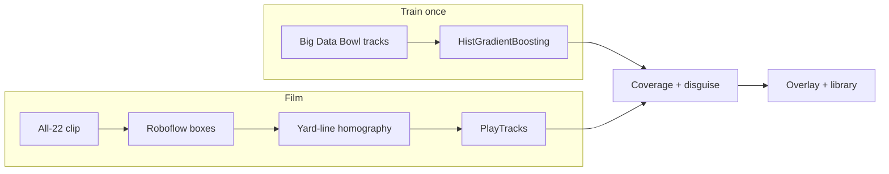

# Gridiron Vision

AI coverage detection for American football film. A clip becomes field coordinates, those coordinates become a coverage call, and those calls become scouting reports in which every claim traces back to the plays that produced it.

Vision and coverage are separate systems. **Roboflow finds players.** A **per-frame homography** puts their feet on a bird’s-eye field. Those points are `PlayTracks` — the same JSON a Big Data Bowl export or a Hudl dump would produce. A **coverage model trained on NFL tracking** reads the points. The overlay never classifies a minimap image.



## What you get

| Surface | What it shows |
| --- | --- |
| Film overlay | Native video, player boxes on every processed frame, minimap PIP from the same detections |
| Coverage panel | Post-snap call (what they ran), pre-snap look, disguise when man/zone or shell disagree |
| Play library | Filed by defense team and family (Man / Zone / Prevent) |
| CLI | Train on BDB, score a corpus, mine pre-snap tells, write a scouting report |

A still is scored as a **pre-snap look**. A video clip is scored as **what they ran**, with the pre-snap model as the look. Cover 1 vs Cover 3 is not a disguise — those are the same 1-high picture.

## Architecture

Everything downstream of vision consumes one contract: `PlayTracks` (22 players as field yards over time, plus quality flags). Film, synthetic data, and NFL tracking all emit that object. Coverage, disguise, tell mining, and the UI never see pixels.

**Film path (default ingest)**

1. `POST /api/film/ingest` (web) or `gridiron film process` copies the clip and runs `FilmPipeline`.
2. Every frame (stride 1) goes to hosted workflow [`american-football-player-trackin`](https://app.roboflow.com/andre-4cotb/workflows/american-football-player-trackin) in workspace `andre-4cotb` (RF-DETR small). Classes: `offense_player`, `defense_player`, `official`.
3. Feet are projected through a **homography solved from painted yard lines** in that frame (`LineRegistrar`), not a fixed camera. A UGA All-22 calibration polygon is fallback only, when the line fit fails. Roboflow’s `Football_Field_Minimap` block in this workspace is that same UGA polygon and is not used on the live path.
4. Tracks become `data/plays/film/<id>.json`. Coverage is scored with `baseline_postsnap.joblib` / `baseline_presnap.joblib`. Rows land in `data/plays/predictions.json`.

Auth for Roboflow is header Bearer (`Authorization: Bearer`). Do not put the API key in the query string or JSON body. Live webcam / RTSP would need Roboflow WebRTC; this repo samples files as frames.

**Coverage path (train once, score many)**

- **Post-snap** (`gridiron train baseline --mode postsnap`) — histogram gradient boosting on engineered features from the first ~2.5s after the snap. This is what the overlay loads.
- **Pre-snap** (`--mode presnap`) — alignment and motion before the snap. Harder; disguise uses it.
- **Set transformer** (`gridiron train net`) — optional, with a per-defender role head. The overlay prefers the booster if both exist.

Holdout is later **weeks** when the corpus has them. Public BDB 2021 coverage labels are often week 1 only; then training holds out whole **games** instead of an 80/20 play split (plays from the same game share personnel and game plan).

Latest local BDB 2021 post-snap holdout (weeks 15–17, 3,253 plays): **70.6%** 8-class accuracy (majority 36.7%), **88.2%** man vs zone, **80.1%** shell, **89.5%** top-2. Pre-snap on the same split: **55.8%** / **80%** man-zone / **67%** shell. Locked gates live in `src/gridiron/coverage/success.py`. Cover 6 and Cover 1↔Cover 3 are the weak cells; film accuracy is dominated by track quality (missing safeties, homography error), not another two points on this table.

## Quick start

Python 3.12, [uv](https://docs.astral.sh/uv/), Node 18+.

```powershell
# 1. Install
uv sync --extra dev --extra vision
cd web; npm install; cd ..

# 2. Synthetic season so every stage runs without downloads
uv run gridiron demo

# 3. Overlay
uv run gridiron serve
cd web; npm run dev
```

API: `http://127.0.0.1:8000`. UI: `http://127.0.0.1:5173`.

`gridiron demo` builds a football-realistic synthetic season, trains models, mines planted tells, and writes a scouting report. Play JSON is stored per corpus (`data/plays/synthetic`, `data/plays/bdb`, `data/plays/film`) so a leftover demo cannot contaminate a Big Data Bowl run. `--source auto` prefers real data over synthetic.

### Film ingest

```powershell
copy .env.example .env
# Set ROBOFLOW_API_KEY from https://app.roboflow.com/andre-4cotb/settings/api
uv run gridiron film process path\to\clip.mp4
```

Or use **Ingest film** in the UI: typed defense team, MP4 or still, then boxes + minimap on the clip.

| Workflow | Value |
| --- | --- |
| Id | `american-football-player-trackin` |
| Host | `https://serverless.roboflow.com` |
| Parameters | `confidence` 0.4, `iou_threshold` 0.3, `class_agnostic_nms` false, `max_detections` 1000 |
| Outputs | `predictions`, `inference_id`, `model_id` |

`ROBOFLOW_DETECT_ONLY=1` (default) is player boxes + local mapping + BDB coverage. Set `0` only if you want the experimental hosted Qwen coverage identifier on a minimap image — that is not the BDB track model.

### Train coverage on Big Data Bowl

```powershell
uv run gridiron bdb download
uv run gridiron bdb build
uv run gridiron train baseline --mode postsnap --source bdb
uv run gridiron train baseline --mode presnap --source bdb
```

Needs a [Kaggle API token](https://www.kaggle.com/docs/api) for the 2021 competition files. Coverage labels fall back to public ngscleanR copies if the old extra Kaggle dataset is gone.

## Commands

| Command | What it does |
| --- | --- |
| `gridiron demo` | Synthetic season: data, training, tells, report |
| `gridiron doctor` | Check CUDA / install |
| `gridiron bdb download` | Fetch Big Data Bowl 2021 via kagglehub |
| `gridiron bdb status` | Which BDB files and coverage-label weeks are on disk |
| `gridiron bdb build` | Normalize BDB into `data/plays/bdb/` and persist league rates |
| `gridiron train baseline` | Gradient boosting (`--source auto\|bdb\|synthetic\|film`, `--mode presnap\|postsnap`) |
| `gridiron train net` | Set transformer + per-defender role head |
| `gridiron film process <file>` | Detect → yard-line homography → BDB coverage |
| `gridiron film evaluate` | Detection / tracking vs corpus ground truth |
| `gridiron film bridge` | How many accuracy points the camera costs |
| `gridiron corpus seed` | Render labeled synthetic All-22 clips |
| `gridiron corpus add <video>` | Register a real clip (angle, source, rights) |
| `gridiron corpus export` | YOLO dataset of frames to label |
| `gridiron score` | Score plays on disk → `predictions.json` |
| `gridiron ingest cfbd --ping` | Verify CollegeFootballData |
| `gridiron ingest cfbd --team "Washington" --season 2025` | Play context from CFBD |
| `gridiron ingest pff` | Import CSVs dropped in `data/pff/` |
| `gridiron tells mine --team X` | Tells vs national baseline, FDR corrected |
| `gridiron tells validate --team X` | Forward-validate hit rates |
| `gridiron scout --team X` | Evidence bundle + report |
| `gridiron scout --self-scout --team Washington` | Tells you are giving away |
| `gridiron serve` | FastAPI for the overlay |

## Data

| Source | Role |
| --- | --- |
| [NFL Big Data Bowl 2021](https://www.kaggle.com/c/nfl-big-data-bowl-2021) | 10 Hz tracking + community coverage labels. This is how the coverage model exists without hand-labeling thousands of clips. |
| [CollegeFootballData](https://collegefootballdata.com) | Situation, drives, PPA/EPA, rosters. Everything except coverage. Free API key. |
| Film (Hudl / All-22) | Roboflow + homography → `PlayTracks`. Hudl cutups belong to the program. |
| PFF | No public developer API. Drop exported CSVs in `data/pff/`; the importer sniffs headers. Session-cookie scraping is out of scope. |

`data/` is gitignored (plays, models, uploads). Never commit `.env`.

## Layout

```
src/gridiron/
  tracking/    PlayTracks, BDB loaders, synthetic generator
  coverage/    features, booster, set transformer, train, eval, disguise
  vision/      Roboflow client, yard-line registration, ingest, pipeline
  ingest/      CFBD, nflverse, PFF drop-folder
  cues/        pre-snap vocabulary
  tells/       forest + SHAP, FDR, forward validation
  scouting/    evidence bundles and reports
  db/          DuckDB + Parquet
  api/         FastAPI (`POST /api/film/ingest`)
web/           React overlay (Vite)
tests/
```

## Limits

- **College coverage rates** start empty. Until the film corpus grows, tell mining borrows NFL rates from `gridiron bdb build` and labels the baseline `borrowed`.
- **Sample size** is the real enemy of tells. ~65 snaps a game × ~50 cues × 8 coverages produces fake “tells” by chance. Mining uses support floors, beta-binomial shrinkage, Wilson intervals, Benjamini–Hochberg FDR, then forward-validates on later weeks.
- **Homography** needs visible yard lines. Broadcast pans, tight ends, and empty end-zone shots will fall back to the UGA polygon or drop off the field.
- **Player model** is a small RF-DETR on a tiny All-22 set. Precision on film is mostly better boxes and labels, not a new coverage architecture.
- **NCAA tech rules**: film-room and scouting, not a gameday sideline device.
- **GPU**: RTX 5060 is Blackwell (`sm_120`). `pyproject.toml` pins CUDA 12.8 PyTorch wheels. `uv run gridiron doctor` to verify.

## Development

```powershell
uv run pytest
uv run ruff check src tests
```

Vision tests that render synthetic All-22 need `opencv` (`--extra vision`).
